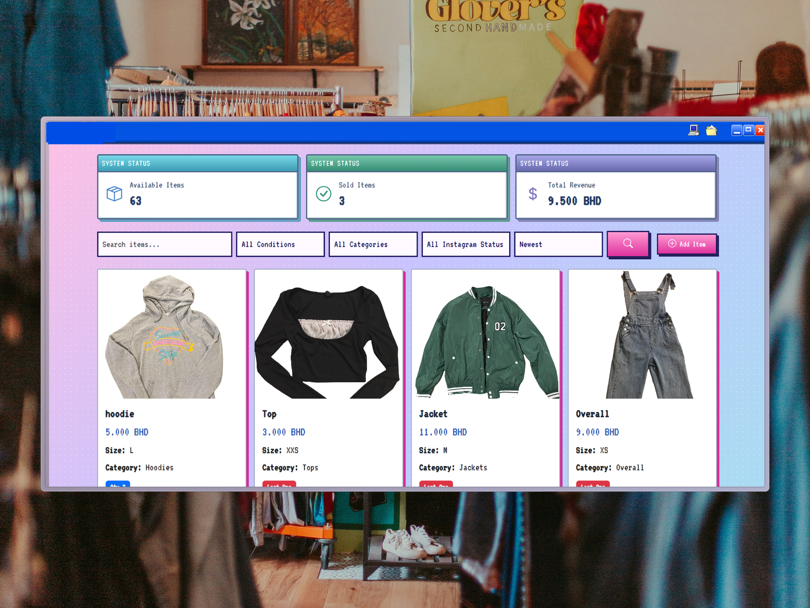
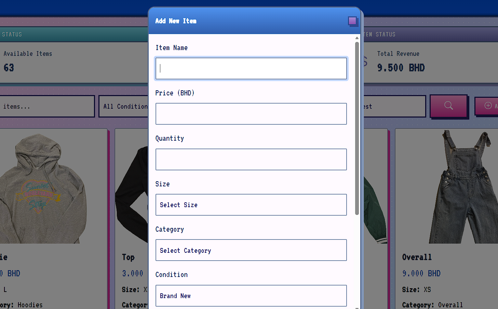
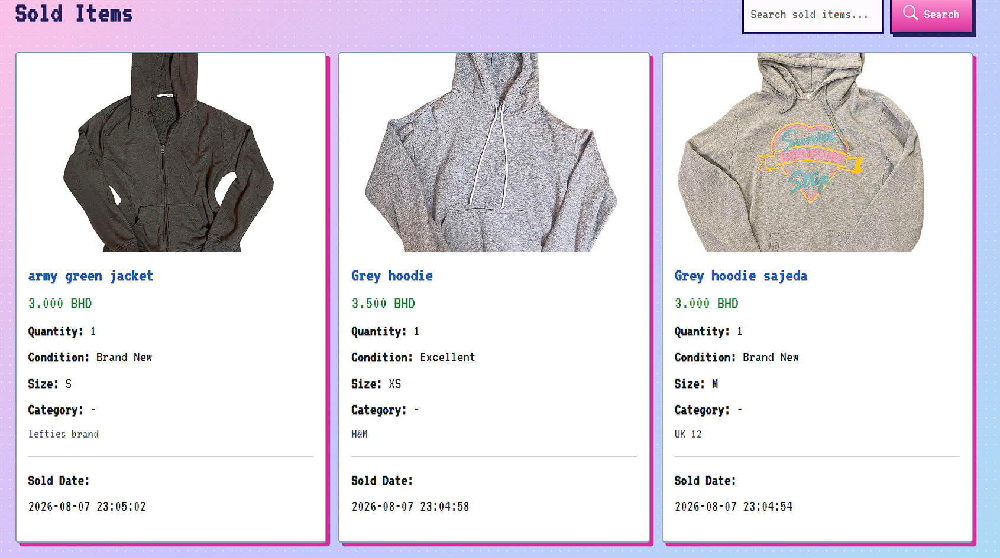
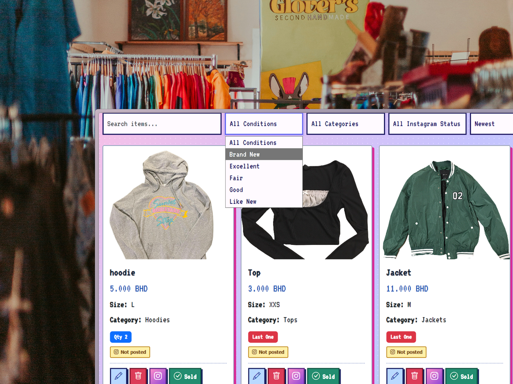

# 🛍️ Inventory Management System

A lightweight inventory management system developed for managing products, stock, sales, and item information for a small resale business.



## Overview

This system was developed to make it easier to manage inventory without relying on spreadsheets or manually tracking product information.

It provides a simple interface for adding, editing, viewing, and managing items while keeping track of stock availability, product information, and sold items.

## Design Concept

The visual design of the system was intentionally created around a **1990s–early 2000s Y2K-inspired aesthetic**.

Since the store focuses on vintage and second-hand items, I wanted the system to reflect the same nostalgic character rather than using a typical modern inventory dashboard.

The interface uses playful visuals, styling, colours, and design elements inspired by websites and desktop interfaces from the late 1990s and early 2000s. The goal was to make the system feel connected to the vintage nature of the store while keeping it functional as an inventory management tool.

## Key Features

### Inventory Management

- Add new inventory items
- Edit existing product information
- Track product quantity and availability
- Organize products by category
- Add product descriptions and condition details

  


### Sales & Sold Items

- Track sold products
- Record sales information
- View previously sold items

  


### Product Information

Each item can include information such as:

- Product name
- Price
- Quantity
- Category
- Size
- Condition
- Description
- Product image
- Availability status
- Date information

### Instagram Tracking

The system includes Instagram-related tracking to help keep track of which products have been posted.

### Simple Inventory Interface

The application was designed to keep inventory management straightforward and practical while incorporating the custom Y2K-inspired visual style.

  


## Technologies Used

### Backend & Database

- Python
- Flask
- SQLite

### Frontend

- HTML
- CSS
- JavaScript

### Development

- Visual Studio Code

## Project Notes

This project was developed as a personal inventory management system for a small resale business.

The project combines practical inventory management functionality with a deliberately nostalgic visual direction inspired by vintage web design and the Y2K era.

The public repository is a portfolio version of the project. Private business data, local database files, backups, and uploaded store data are not included for privacy and security reasons.

## Running the Project Locally

### Requirements

- Python
- pip

### Installation

Install the required Python dependencies according to the project's environment and configuration.

### Run the Application

```bash
python app.py
